# Architecture Documentation

**Auto-generated on 2026-02-27 00:56 UTC** by [generate-docs.yml](.github/workflows/generate-docs.yml)

> This document is automatically regenerated by GitHub Actions whenever source code changes are pushed to the `master` branch.

## 1. System Overview

The **CISA ED 26-03 Compliance Tracker** is a single-page Streamlit web application that guides federal agencies through the 5-step CISA action sequence for Cisco SD-WAN vulnerability remediation (CVE-2026-20127 & CVE-2022-20775).

```mermaid
graph TB
    User["🧑‍💻 Agency Analyst<br/>Browser"] --> |HTTPS| Streamlit["🦅 Streamlit App<br/>app.py"]
    Streamlit --> |SQLAlchemy ORM| DB["🗄️ SQLite / PostgreSQL<br/>database.py"]
    Streamlit --> |JSON / CSV Export| Report["📄 CISA Report<br/>March 5 Deadline"]
    Streamlit --> |File Upload| Import["📥 Bulk Import<br/>CSV / Excel / JSON / TSV"]
    Docker["🐳 Docker Container<br/>python:3.11-slim"] --> Streamlit
    GCR["☁️ Google Cloud Run"] --> Docker
    IAP["🔒 Identity-Aware Proxy"] --> GCR

    style Streamlit fill:#1f77b4,color:#fff
    style DB fill:#2ca02c,color:#fff
    style IAP fill:#d62728,color:#fff
    style GCR fill:#ff7f0e,color:#fff
```

## 2. Technology Stack

| Layer | Technology | Version / Spec |
|-------|-----------|----------------|
| Frontend / UI | `streamlit` | `==1.31.0` |
| Data Processing | `pandas` | `==2.2.0` |
| ORM / Database | `sqlalchemy` | `>=2.0.36` |
| Excel Import | `openpyxl` | `>=3.1.0` |
| Container | Docker | Base: `python:3.11-slim` |
| Deployment | Google Cloud Run | Port `8080` |
| Auth | Google IAP | Organizational SSO |
| Database | SQLite (dev) / PostgreSQL (prod) | Auto-created on startup |

## 3. Data Model

### `SDWANInstance`

| Column | Purpose |
|--------|---------|
| `id` | Primary key |
| `hostname` | Device hostname / identifier |
| `ip_address` | Management IP address |
| `sys_type` | vManage (Manager) or vSmart (Controller) |
| `version` | Current Cisco SD-WAN software version |
| `forensics_captured` | All 3 forensic artifacts collected (derived) |
| `snapshot_captured` | VM snapshot captured before patching |
| `core_dump_captured` | Admin core dump (/opt, /var) exported |
| `home_dir_copied` | /home directory copy secured |
| `patch_applied` | Cisco patch applied (gated by forensics) |
| `hunt_completed` | All 6 hunt checklist items completed |
| `hunt_omp_peers_checked` | OMP peers reviewed (show omp peers) |
| `hunt_control_connections_checked` | Control connections verified |
| `hunt_unauthorized_users_checked` | User accounts audited (AAA config) |
| `hunt_version_downgrade_checked` | Software version regression checked |
| `hunt_audit_logs_checked` | Audit/syslog logs reviewed |
| `hunt_config_changes_checked` | Config changes reviewed vs baseline |
| `hardening_implemented` | Hardening measures applied per Cisco guide |
| `notes` | Free-text notes (location, environment, etc.) |
| `timestamp` | Record creation timestamp |
| `last_updated` | Last modification timestamp |
| `hunt_findings` | SQLAlchemy relationship to HuntFinding records |

### `HuntFinding`
_Log individual threat hunt findings per asset for the March 5 report._

| Column | Purpose |
|--------|---------|
| `id` | Primary key |
| `asset_id` | Foreign key → SDWANInstance.id |
| `category` | Finding category (Rogue Peer, Unauthorized User, etc.) |
| `severity` | CRITICAL / HIGH / MEDIUM / INFO |
| `description` | Detailed finding description |
| `evidence` | CLI output or log excerpt |
| `analyst` | Name of analyst who logged the finding |
| `timestamp` | Record creation timestamp |
| `asset` | SQLAlchemy relationship back to SDWANInstance |

## 4. Application Structure

`app.py` — **919 lines** | `database.py` — **69 lines**

### UI Sections

| # | Section | Line |
|---|---------|------|
| 1 | 1️⃣ Inventory — All In-Scope Cisco SD-WAN Systems | L110 |
| 2 | 2️⃣ Collect Artifacts → 3️⃣ Patch → 4️⃣ Hunt → 5️⃣ Implement Hardening | L308 |
| 3 | 🔍 Cisco SD-WAN Threat Hunt Guide | L465 |
| 4 | 📓 Hunt Findings Log | L639 |
| 5 | 📤 CISA Reporting Engine | L737 |

### Application Flow

```mermaid
flowchart TD
    A["🏠 Page Load"] --> B["⏰ Deadline Countdowns"]
    B --> C["📊 Dashboard Metrics"]
    C --> D["1️⃣ Asset Inventory"]
    D --> D1["Manual Registration"]
    D --> D2["Bulk Import<br/>CSV/Excel/JSON/TSV"]
    D --> E["2-5️⃣ Compliance Workflow"]
    E --> E1["Forensics<br/>3 Artifact Checkboxes"]
    E1 --> |"Gate: All 3 Required"| E2["Patch Toggle"]
    E2 --> E3["Hunt<br/>6-Point Checklist"]
    E3 --> E4["Hardening Toggle"]
    E --> F["🔍 Threat Hunt Guide"]
    F --> F1["Attack Chain"]
    F --> F2["CLI Commands"]
    F --> F3["IOC Reference"]
    F --> F4["Decision Flowchart"]
    E --> G["📋 Hunt Findings Log"]
    G --> H["📤 CISA Reporting Engine"]
    H --> H1["JSON Export"]
    H --> H2["CSV Export"]

    style A fill:#1f77b4,color:#fff
    style E fill:#2ca02c,color:#fff
    style H fill:#d62728,color:#fff
```

## 5. Module Reference

### database.py

ORM models and database session factory using SQLAlchemy 2.0 `Mapped` / `mapped_column` style.

- **`Base`** — SQLAlchemy declarative base class
- **`SDWANInstance`** — 23 columns (line 11)
- **`HuntFinding`** — 10 columns (line 44)

- **`init_db()`** — Database utility function (line 68)

### app.py

Streamlit single-page application.

**Imports:** `database`, `datetime`, `io`, `json`, `pandas`, `re`, `streamlit`

**Functions:**

- **`get_session()`** — Application helper (line 21)

## 6. Deployment Architecture

```mermaid
graph LR
    subgraph "Local Development"
        DEV["streamlit run app.py"] --> SQLITE["SQLite<br/>compliance_data.db"]
    end

    subgraph "Production (GCP)"
        IAP2["🔒 IAP<br/>Org SSO"] --> CR["☁️ Cloud Run"]
        CR --> CONT["🐳 Docker<br/>python:3.11-slim"]
        CONT --> APP["Streamlit<br/>Port 8080"]
        APP --> PG["🐘 Cloud SQL<br/>PostgreSQL"]
    end

    style IAP2 fill:#d62728,color:#fff
    style CR fill:#ff7f0e,color:#fff
    style PG fill:#2ca02c,color:#fff
```

- **Base Image:** `python:3.11-slim`
- **Exposed Port:** `8080`
- **Entrypoint:** `["streamlit", "run", "app.py", "--server.port=8080", "--server.address=0.0.0.0"]`

## 7. File Inventory

| File | Lines | Purpose |
|------|-------|---------|
| `.github/scripts/generate_architecture.py` | 474 | CI/CD script |
| `.github/workflows/generate-docs.yml` | 42 | GitHub Actions workflow |
| `=2.0.36` | 14 |  |
| `ACSC-led Cisco SD-WAN Hunt Guide.pdf` | 24340 | Official joint threat hunt guide (PDF) |
| `ARCHITECTURE.md` | 251 | This auto-generated architecture doc |
| `Dockerfile` | 21 | Container build configuration |
| `LICENSE` | 21 | MIT License — BlueFalconInk LLC |
| `PRD_ED_26_03.md` | 201 | Product Requirements Document |
| `README.md` | 187 | Setup, features, and deployment guide |
| `app.py` | 919 | Main Streamlit application |
| `database.py` | 69 | SQLAlchemy ORM models & session factory |
| `requirements.txt` | 4 | Python dependency list |

## 8. CI/CD Pipeline

```mermaid
graph LR
    PUSH["git push<br/>master"] --> |"paths: **.py,<br/>requirements.txt,<br/>Dockerfile"| GHA["GitHub Actions<br/>generate-docs.yml"]
    GHA --> PY["Run<br/>generate_architecture.py"]
    PY --> |"Introspect codebase"| MD["ARCHITECTURE.md"]
    MD --> |"git commit + push"| REPO["📦 Repository"]

    style PUSH fill:#1f77b4,color:#fff
    style GHA fill:#ff7f0e,color:#fff
    style REPO fill:#2ca02c,color:#fff
```

The `generate-docs` workflow:
1. Triggers on pushes to `master` that modify `*.py`, `requirements.txt`, or `Dockerfile`
2. Runs `generate_architecture.py` which introspects the codebase via AST parsing
3. Produces Mermaid diagrams, data model docs, and module reference
4. Auto-commits `ARCHITECTURE.md` back to the repository

---

*Built by [BlueFalconInk LLC](https://github.com/bluefalconink) — Defending federal networks with open-source tooling.*
